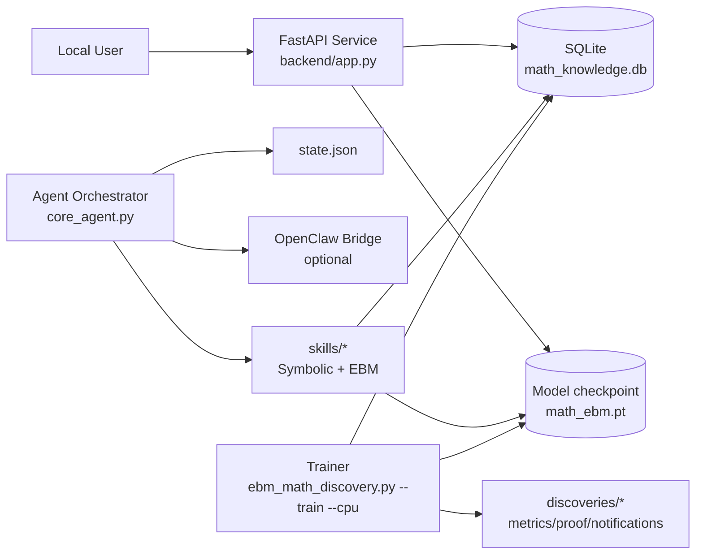

# Local Training Deployment Architecture

This document codifies the **minimum architecture** needed to deploy SciOracle locally for training + serving.

## 1) Components



## 2) Runtime Modes

- **Trainer mode**: generates datasets, trains model, writes `math_ebm.pt` and DB records.
- **API mode**: serves `/api/query`, `/api/chat`, research endpoints.
- **Orchestrator mode**: runs Oracle/Validator/EBM loops and optional OpenClaw sync.

## 3) Local deployment options

### Option A: Python-only (recommended for first run)

1. Install dependencies:
   ```bash
   pip install -r requirements.txt
   ```
2. Train baseline model:
   ```bash
   python ebm_math_discovery.py --train --cpu
   ```
3. Start API:
   ```bash
   uvicorn backend.app:app --host 0.0.0.0 --port 8000
   ```
4. Start orchestrator (new shell):
   ```bash
   python core_agent.py
   ```

### Option B: Docker Compose stack

Use `docker-compose.local-training.yml`:

```bash
docker compose -f docker-compose.local-training.yml up --build
```

This starts:
- `trainer` (CPU training)
- `api` (FastAPI on port `8000`)
- `orchestrator` (core agent loop)

## 4) Required files and artifacts

- Configuration: `config.yaml`
- Formula corpus: `formula_corpus.json`
- Runtime state: `state.json`
- Trained model: `math_ebm.pt`
- Research DB: `math_knowledge.db`
- Discovery artifacts: `discoveries/*`

## 5) Hardening checklist before non-local use

- Set explicit CORS origins (avoid `*`).
- Run with managed DB (e.g., Postgres) if multi-user.
- Add auth + API key gating.
- Separate background training from serving process.
- Add monitoring/metrics and backup of DB + checkpoint.
